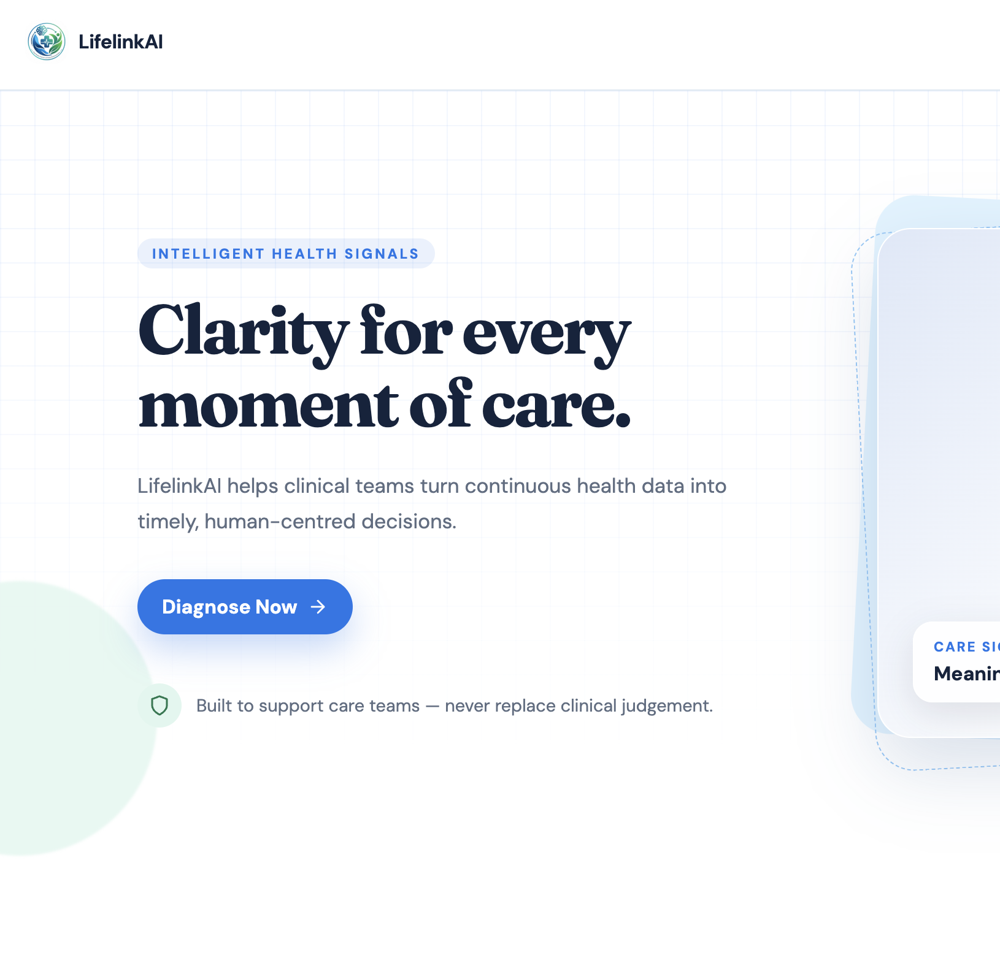
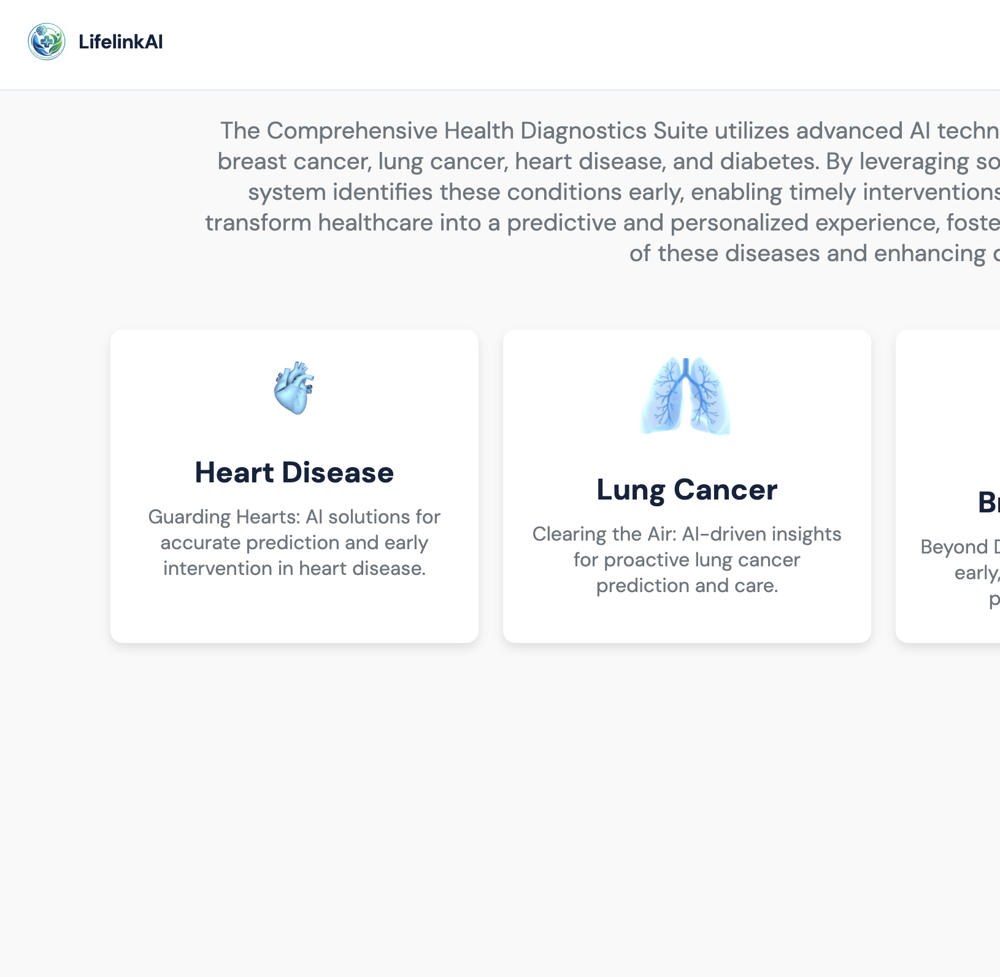
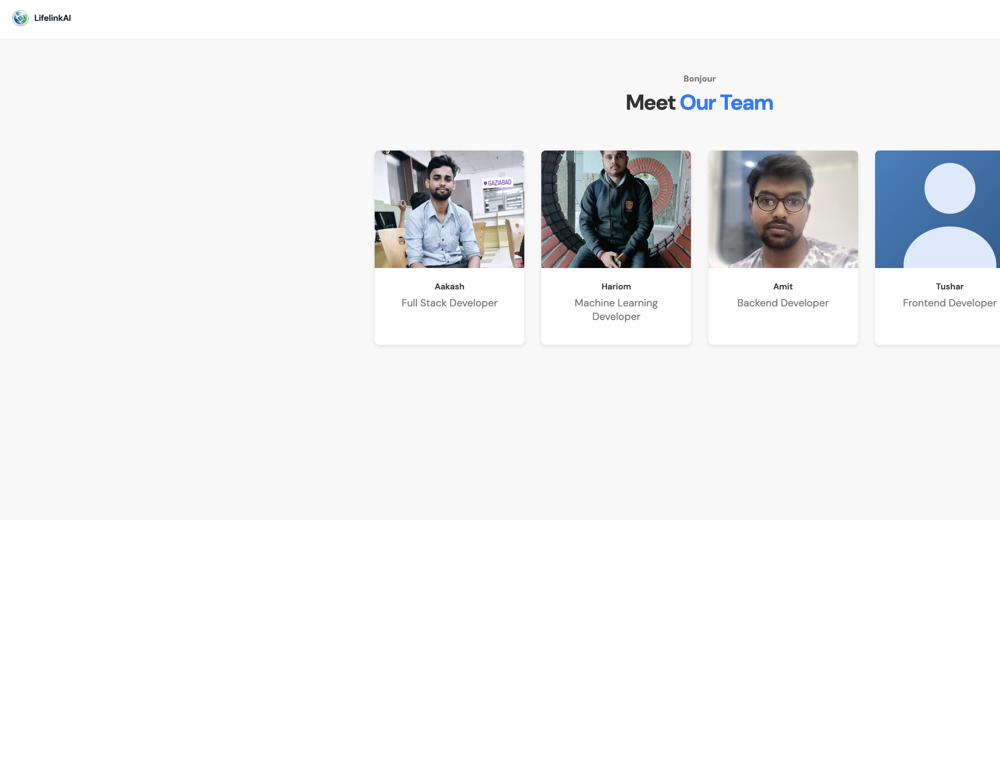

# LifelinkAI — Multi-Disease Prediction System

LifelinkAI is a smart disease prediction and health monitoring platform. It predicts **heart disease**, **diabetes**, **breast cancer**, and **lung cancer** using machine learning models, with a modern MERN-stack web app for college demos and clinical-style workflows.

> Rebranded from PredictiX for this project showcase.

## Features

- **User auth** — Sign up / login with protected routes (Context API + JWT cookies)
- **Four predictors**
  - Heart disease — Logistic Regression
  - Diabetes — Support Vector Machine (SVM)
  - Breast cancer — CNN (image upload)
  - Lung cancer — InceptionResNet (`LCD.h5`, image upload)
- **Prescription upload** — Auto-fills heart / diabetes forms via regex parsing
- **PDF reports** — Downloadable prediction reports (`pdf-lib`)
- **Single Node server** — ML models run via Node `child_process` (no separate Flask server)
- **Canva-style landing UI** — Hero, capabilities, approach, and team About page

## Tech Stack

| Layer | Stack |
| --- | --- |
| Frontend | React (Vite), React Router, Context API, React Toastify |
| Backend | Node.js, Express, Multer, JWT, MongoDB (Atlas) |
| ML | Python + scikit-learn / TensorFlow (spawned from Node) |

## Team

| Name | Role |
| --- | --- |
| Aakash | Full Stack Developer |
| Hariom | Machine Learning Developer |
| Amit | Backend Developer |
| Tushar | Frontend Developer |

## Machine Learning Models

- **Heart** — Age, Sex, Chest Pain Type, Resting BP, Cholesterol, Fasting BS, ECG, Max HR, Exercise Angina, ST Depression, Peak ST Slope, Vessels, Thalassemia
- **Diabetes** — Pregnancies, Glucose, Blood Pressure, Skin Thickness, Insulin, BMI, Diabetes Pedigree Function, Age
- **Breast cancer** — Breast tissue image → CNN
- **Lung cancer** — Lung X-ray / CT → InceptionResNet (`LCD.h5`, ~209MB, stored with **Git LFS**)

## Getting Started

### Prerequisites

- Node.js 18+
- Python 3 with TensorFlow (for lung / breast models)
- MongoDB Atlas URI (or local MongoDB)
- Git LFS (to pull `LCD.h5`)

```bash
git lfs install
git clone https://github.com/amitpal1554/LifelinkAI.git
cd LifelinkAI
git lfs pull
```

### Backend

```bash
cd Backend
cp env.txt .env   # then fill MONGODB_URI, JWT secrets, etc.
npm install
npm run server
```

### Frontend

```bash
cd Frontend
npm install
npm run dev
```

Or from `Backend/`:

```bash
npm run dev   # runs API + Vite together via concurrently
```

Frontend proxies `/api` to the backend (see `Frontend/vite.config.js`).

## Usage

1. Sign up or log in
2. Open a predictor (Heart / Diabetes / Breast / Lung)
3. Heart & Diabetes — fill the form or upload a prescription
4. Breast & Lung — upload a medical image
5. Submit → view result → download PDF report if needed

## Project Structure

```text
LifelinkAI/
├── Backend/                 # Express API + ML spawn scripts
│   ├── controllers/
│   ├── ML/                  # Models used by the server (incl. LCD.h5 via LFS)
│   ├── models/
│   ├── routes/
│   ├── middlewares/
│   └── index.js
├── Frontend/                # React + Vite UI (LifelinkAI branding)
├── ML/                      # Shared / reference ML scripts & weights
├── Screenshots/             # App screenshots
├── LICENSE
└── README.md
```

## Screenshots

### Homepage


### Log In


### Predictors


### About


## Notes

- **Secrets** — Never commit `.env`. Use `Backend/env.txt` as a template.
- **Large files** — `LCD.h5` is tracked with Git LFS. Clone with LFS enabled or lung prediction will fail.
- **Medical Reports/** — Large training image datasets are not included in the repo.

## License

MIT — see [LICENSE](LICENSE).
